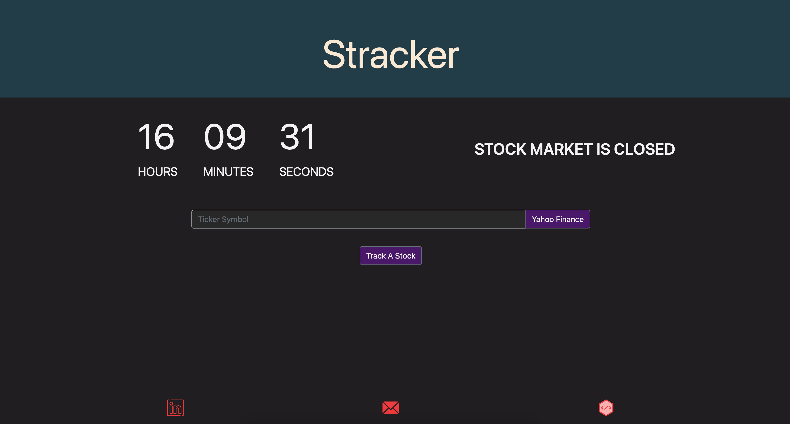
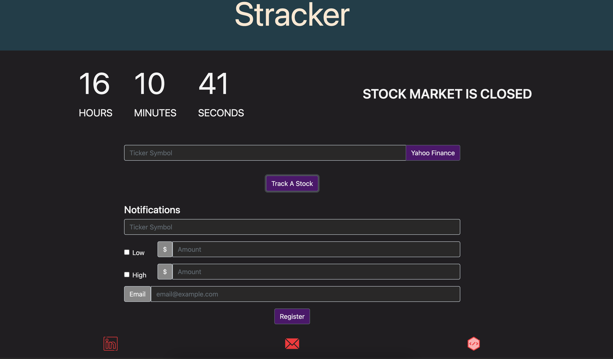
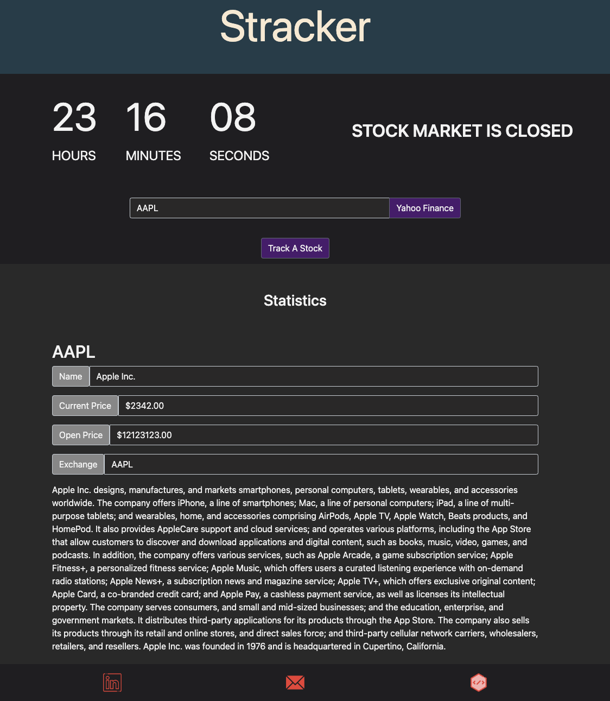

# Stracker
Stock tracker API that keeps tracks of your stocks using Node.js. The website provides a UI that allows you to check information on the target stocks using the [Yahoo Finance API](https://www.yahoofinanceapi.com/) and [Alpha Vantage API](https://polygon.io/stocks?gclid=EAIaIQobChMI_r-_zPW89gIVmz6tBh1sEA5PEAAYASAAEgKBr_D_BwE). Registering a stock and entering the target prices allows you to keep track of that stock through notified emails sent on intervals. If your target stock is below your target low price and/or your target stock is higher than your target high price, an email is sent to you indicating so.  
Stracker's webpage also indicates the current time and a timer which indicates the time before the stock market closes.

## Images

## Links
https://rapidapi.com/yourdevmail/api/yh-finance8

__NOTE: Only the Yahoo Finance API is set up right now__

## Tech stack
Stracker utilizes NodeJS to send pages to the client. It also uses nodemailer to send emails to the user if the stock price for a targeted stock triggers the threshold assigned by the user.

## Running the server
URL: [http://localhost:6060/](http://localhost:6060/)  
The server is located under the `server` folder.  
Running the server (on the terminal):  
`cd server`  
`node index.js`  
Currently, the automated sender will send the notifications every 20 minutes. You can change the frequency of this by changing the value of `AUTOMATED_NOTIFICATION_INTERVAL`. It uses [cron](https://www.npmjs.com/package/node-cron) to schedule the notifiers.

## Requirements
There are some requirements for launching this API locally. Specifically, API keys from Yahoo Finance and Alpha Vantage are required to retrieve stock information. You can also provide an automated email sender to notify you for any updates on the stocks you wished to track. Just provide an email along with the password to auto send the email.

## Setting up automated email sender
Currently, it's using gmail as the main service. If you do choose gmail as a provider, you just need to allow for [less secure apps](https://support.google.com/a/answer/6260879?hl=en) to allow for automated sending.

__Please ensure you include your config in the .gitignore__